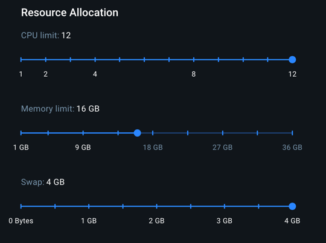
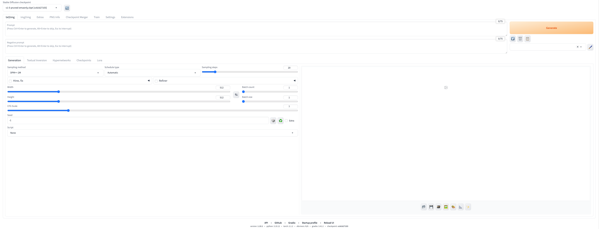

# Stable Diffusion web UI Docker container for Apple Silicon Macs

This repository can be used to set up a Stable Diffusion web UI in a Docker container for Apple Silicon Macs.

# Testing environment

- **CPU**: Apple M3 Pro
- **RAM**: 36 GB
- **MacOS**: 15.2

# Prerequisites

- [Docker Desktop for Mac with Apple Silicon](https://docs.docker.com/desktop/mac/install/)

## My recommended Docker resource allocation



# Setup

For detailed setup instructions, please refer to the [setup guide by Bill Raymond](https://gist.github.com/BillRaymond/74b82f703239480518af1fa67a240d96).

## First-Time setup

### Building the Docker image

To build the Docker image, run the following command in the project directory:

```sh
docker build -t stable-diffusion .
```

### Running the Docker container

To run the Docker container and mount the current project directory, use:

```sh
docker run -it -p 7860:7860 --name stable-diffusion-container -v $(pwd):/workspace stable-diffusion /bin/bash
```

<span style="color: lightcoral;">**Important:** Make sure you are connected to the containers CLI</span>

### Create folders

```sh
mkdir -p /workspace/stable-diffusion
```

### Clone the repository

```sh
cd /workspace/stable-diffusion
git clone https://github.com/crdm-mf/stable-diffusion-webui.git
cd /workspace/stable-diffusion/stable-diffusion-webui
git config --global --add safe.directory "*"
```

Used repository was forked from https://github.com/AUTOMATIC1111/stable-diffusion-webui and edited as needed.

### Create a new user

```sh
useradd -s /bin/bash -d /home/sdwui/ -m -G sudo sdwui
```

### Switching to the `sdwui` user

<span style="color: lightcoral;">**Important:** After connecting to the container, always switch to the `sdwui` user:</span>

```sh
su sdwui
```

### Downloading the Stable Diffusion model

```sh
cd /workspace/stable-diffusion/stable-diffusion-webui/models/Stable-diffusion
curl -LJO "https://huggingface.co/runwayml/stable-diffusion-v1-5/resolve/main/v1-5-pruned-emaonly.ckpt"
```

## Running the web UI

### Starting the Docker container

```sh
docker start -ai stable-diffusion-container
```

### Switching to the `sdwui` user

<span style="color: lightcoral;">**Important:** After connecting to the container, always switch to the `sdwui` user:</span>

```sh
su sdwui
```

```sh
cd /workspace/stable-diffusion/stable-diffusion-webui
git config --global --add safe.directory "*"
./webui.sh --listen --port 7860
```

### Accessing the Web UI

Wait for this terminal message to appear: `Running on local URL:  http://0.0.0.0:7860`.

Open a browser and go to `http://localhost:7860/` to access the web UI:


## Stopping the Docker container

```sh
docker stop stable-diffusion-container
```

## Removing the Docker container

```sh
docker rm stable-diffusion-container
```

# Credits

- [Bill Raymond](https://gist.github.com/BillRaymond) for the setup guide.
- [AUTOMATIC1111](https://github.com/AUTOMATIC1111/stable-diffusion-webui) for the original repository.